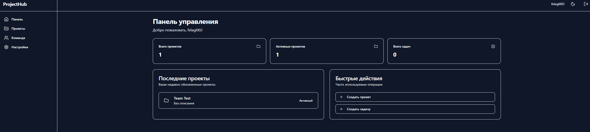
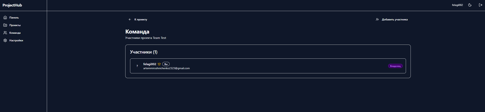
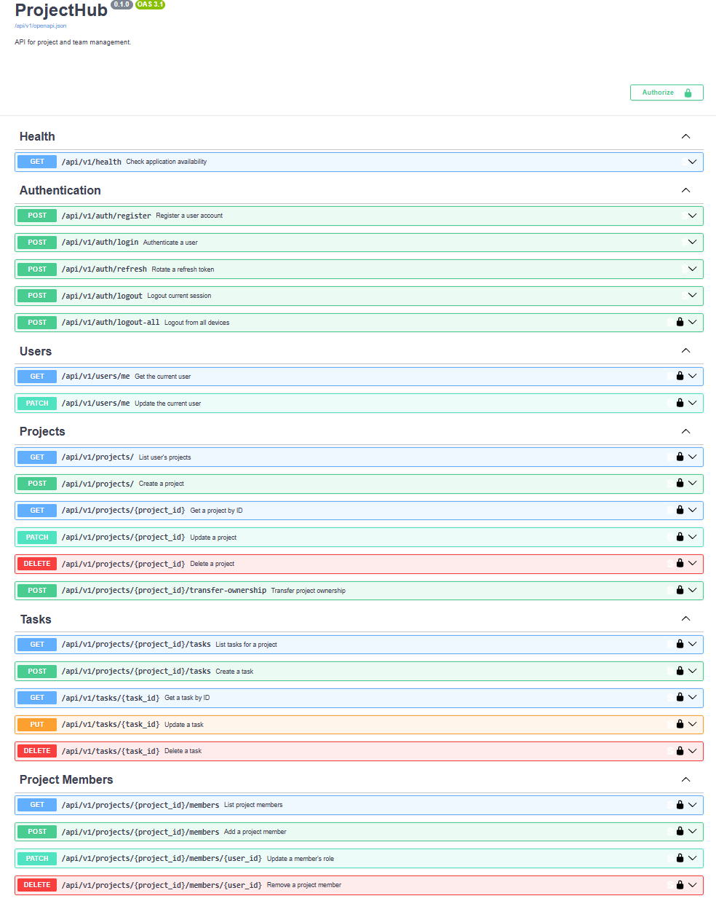
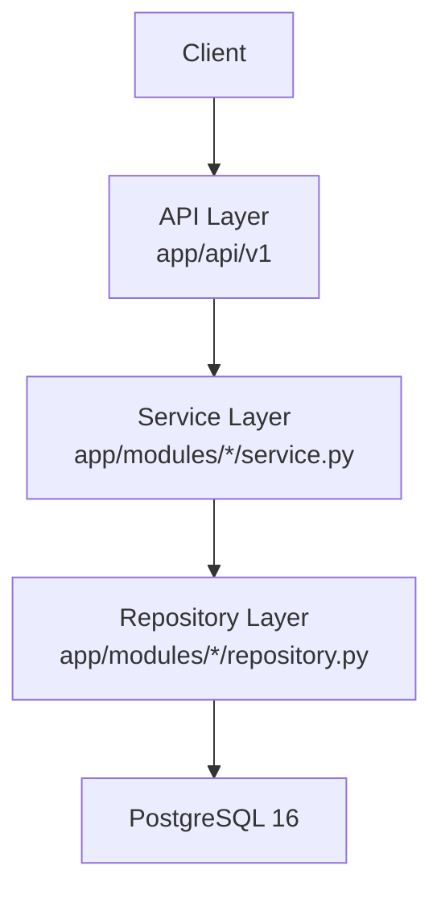
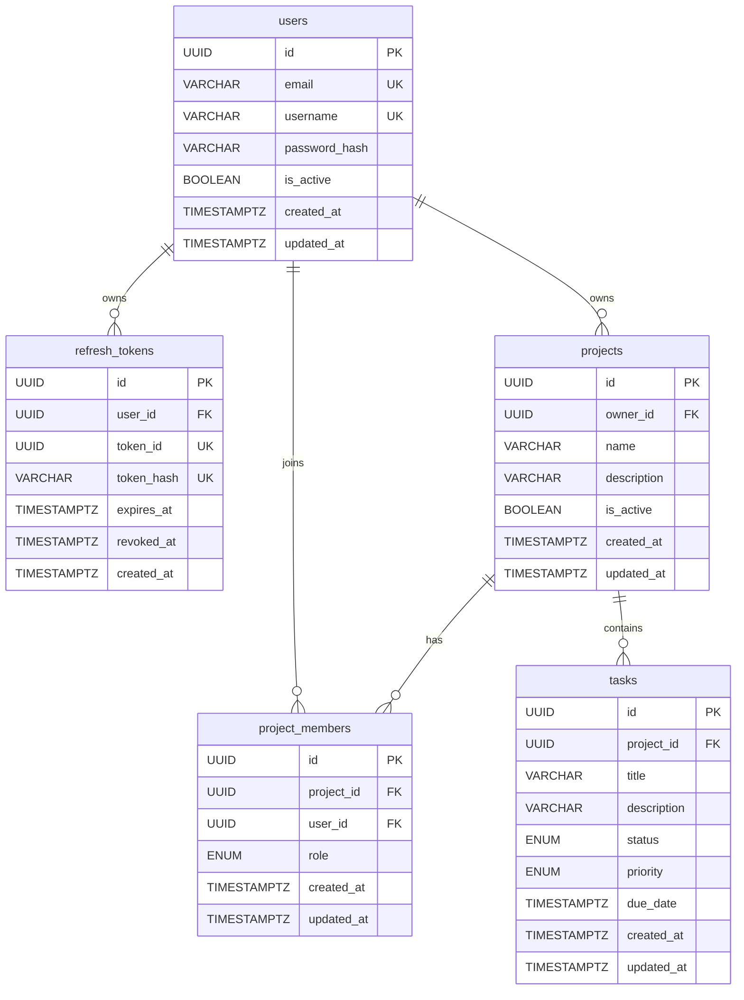
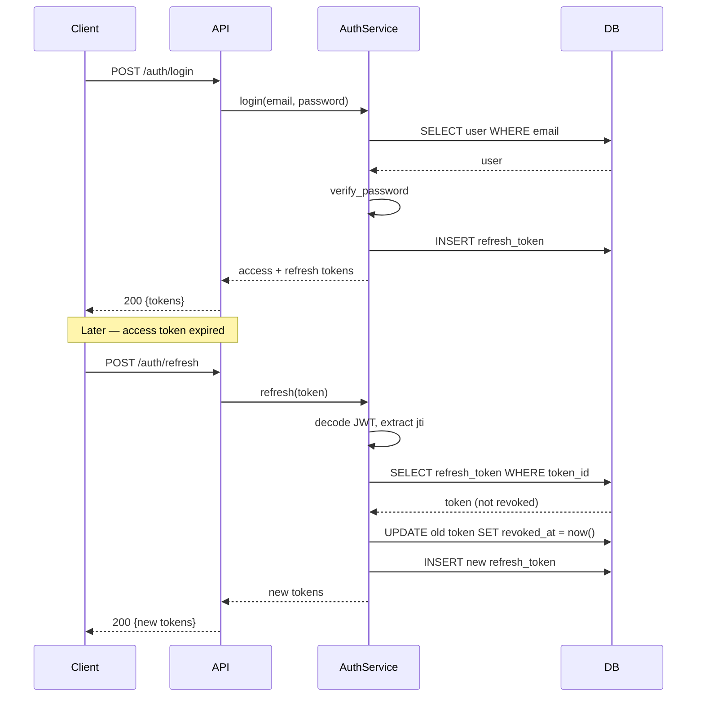
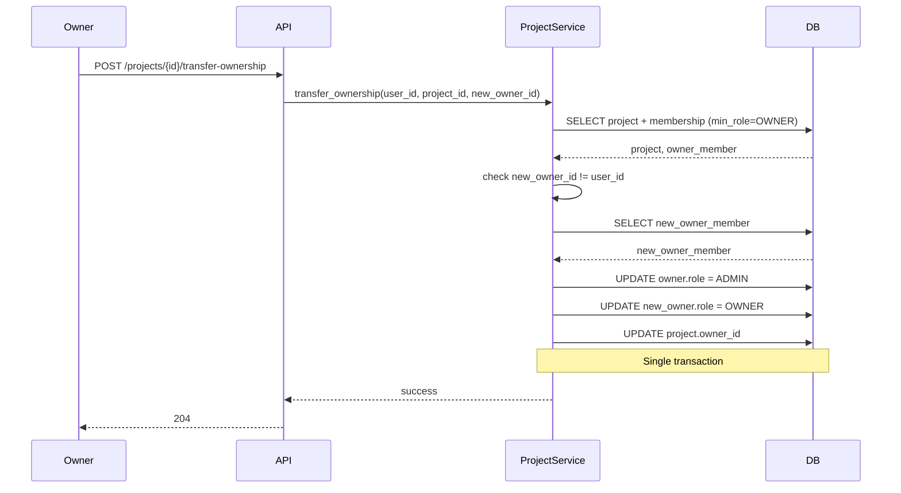

# ProjectHub

**ProjectHub** is a modern, full-stack project management application. Built with FastAPI (backend) and React 19 (frontend), it provides a complete solution for managing projects, tasks, and team collaboration with role-based access control.


## 📸 Screenshots

### Dashboard


Project overview with metrics, recent projects, and quick actions.

### Team Management


Role-based access control: OWNER, ADMIN, MEMBER per project.

### API Documentation


Full OpenAPI documentation available at /api/v1/docs.

## ✨ Features

### Backend
- **User Management**: Registration, authentication with JWT tokens (access + refresh)
- **Project Management**: Create, update, delete projects with ownership tracking
- **Task Management**: Full CRUD operations with status, priority, and filtering
- **Team Collaboration**: Role-based access control (MEMBER, ADMIN, OWNER)
- **Member Management**: Add/remove team members, manage roles and permissions
- **RESTful API**: Clean, documented API following REST principles
- **Type Safety**: Full type hints coverage with Pydantic validation
- **Database Migrations**: Alembic integration for schema versioning
- **Comprehensive Testing**: 237 tests (191 unit + API, 46 integration)
- **Integration Tests**: real PostgreSQL via Testcontainers
- **Logout**: single device and all devices (idempotent)
- **Transfer Ownership**: atomic transfer with role demotion

### Frontend
- **Modern UI**: Responsive interface with dark mode support
- **Kanban Board**: Drag-and-drop task management with @dnd-kit
- **Real-time Updates**: Optimistic UI updates with TanStack Query v5
- **Form Validation**: React Hook Form + Zod for type-safe forms
- **Toast Notifications**: User feedback with Sonner
- **Error Handling**: Global error boundary and 404 page
- **Accessibility**: WCAG-compliant components with proper ARIA attributes
- **Type Safety**: Full TypeScript coverage with strict mode

## 🏗️ Architecture

### Backend Architecture

Three-layer architecture following separation of concerns:



**Responsibilities:**
- **Router** — HTTP, validation, auth via `Depends`.
- **Service** — business logic, RBAC checks.
- **Repository** — SQL queries, no business logic.
- **Models / Schemas** — SQLAlchemy 2.0 ORM, Pydantic v2.

### Database Schema



**Key invariants:**
- One OWNER per project (partial unique index on `role='OWNER'`).
- Unique (`project_id`, `user_id`) in `project_members`.
- Unique (`owner_id`, `name`) in `projects`.

### Frontend Architecture

Feature-Sliced Design with clear separation between layers:

```
frontend/src/
├── app/                    # Application layer
│   ├── providers/          # Context providers (Query, Theme)
│   └── router/             # Route configuration
├── pages/                  # Page components
├── widgets/                # Complex UI blocks (Layout)
├── features/               # Business features
│   ├── auth/               # Authentication feature
│   ├── projects/           # Projects feature
│   ├── tasks/              # Tasks feature
│   └── project-members/    # Team management feature
└── shared/                 # Shared utilities
    ├── ui/                 # UI components (shadcn/ui)
    ├── api/                # API client configuration
    └── lib/                # Utility functions
```

## 🔄 Request Flow

### Refresh Token Flow



### Transfer Ownership Flow



## 🛠️ Tech Stack

### Backend
- **[FastAPI](https://fastapi.tiangolo.com/)** 0.115+ - Modern async web framework
- **[Python](https://www.python.org/)** 3.13 - Programming language
- **[PostgreSQL](https://www.postgresql.org/)** 16 - Primary database
- **[SQLAlchemy](https://www.sqlalchemy.org/)** 2.0 - Async ORM
- **[Pydantic](https://docs.pydantic.dev/)** 2.0+ - Data validation
- **[Alembic](https://alembic.sqlalchemy.org/)** - Database migrations
- **[PyJWT](https://pyjwt.readthedocs.io/)** - JWT authentication
- **[pwdlib](https://github.com/frankie567/pwdlib)** - Password hashing (Argon2)

### Frontend
- **[React](https://react.dev/)** 19 - UI library
- **[TypeScript](https://www.typescriptlang.org/)** 5.7 - Type safety
- **[Vite](https://vite.dev/)** 7 - Build tool
- **[TanStack Query](https://tanstack.com/query)** 5 - Server state management
- **[React Hook Form](https://react-hook-form.com/)** 7 - Form management
- **[Zod](https://zod.dev/)** - Schema validation
- **[Zustand](https://zustand-demo.pmnd.rs/)** - Client state (auth)
- **[Axios](https://axios-http.com/)** - HTTP client
- **[@dnd-kit](https://dndkit.com/)** - Drag and drop
- **[TailwindCSS](https://tailwindcss.com/)** 4 - Styling
- **[shadcn/ui](https://ui.shadcn.com/)** - UI components
- **[Sonner](https://sonner.emilkowal.ski/)** - Toast notifications
- **[Lucide React](https://lucide.dev/)** - Icons

## 📁 Project Structure

```
projecthub/
├── app/                        # FastAPI application
│   ├── api/                    # API routes and dependencies
│   ├── core/                   # Configuration, security, exceptions
│   ├── db/                     # Database session and model registry
│   ├── modules/                # Users, projects, tasks, and members
│   ├── factory.py
│   └── main.py
├── alembic/                    # Database migrations
├── tests/
│   ├── api/                    # API tests
│   ├── unit/                   # Unit tests
│   └── integration/            # Testcontainers integration tests
├── frontend/                   # React application
├── compose.yaml                # Docker Compose services
├── Dockerfile
├── Makefile
├── pyproject.toml
├── uv.lock
├── .env.example
└── README.md
```

## 🚀 Quick Start

### Prerequisites

- **Docker** with Docker Compose
- **Python** 3.13+
- **uv**

### Installation

```bash
git clone https://github.com/FELAGI0/ProjectHub.git
cd ProjectHub
cp .env.example .env
# Edit JWT_SECRET_KEY and POSTGRES_PASSWORD in .env
make up
curl http://localhost:8000/api/v1/health
# Expected: {"status":"ok","database":"ok"}
```

- API docs: http://localhost:8000/docs
- Frontend: http://localhost:3000

## 📚 API Documentation

Interactive API documentation is available at:

- **Swagger UI**: http://localhost:8000/docs
- **ReDoc**: http://localhost:8000/redoc

### Key Endpoints

#### Authentication
- `POST /api/v1/auth/register` - Register new user
- `POST /api/v1/auth/login` - Login and get JWT tokens
- `POST /api/v1/auth/refresh` - Refresh access token
- `POST /api/v1/auth/logout` - Logout (revoke refresh token)
- `POST /api/v1/auth/logout-all` - Revoke all refresh tokens

#### Projects
- `GET /api/v1/projects` - List user's projects
- `POST /api/v1/projects` - Create new project
- `GET /api/v1/projects/{id}` - Get project details
- `PATCH /api/v1/projects/{id}` - Update project
- `DELETE /api/v1/projects/{id}` - Delete project
- `POST /api/v1/projects/{id}/transfer-ownership` - Transfer ownership

#### Tasks
- `GET /api/v1/projects/{id}/tasks` - List project tasks
- `POST /api/v1/projects/{id}/tasks` - Create task
- `GET /api/v1/tasks/{id}` - Get task details
- `PATCH /api/v1/tasks/{id}` - Update task (status, priority, etc.)
- `DELETE /api/v1/tasks/{id}` - Delete task

#### Project Members
- `GET /api/v1/projects/{id}/members` - List members
- `POST /api/v1/projects/{id}/members` - Add member
- `PATCH /api/v1/projects/{id}/members/{user_id}` - Update member role
- `DELETE /api/v1/projects/{id}/members/{user_id}` - Remove member

## 🔐 Authentication & Authorization

### JWT Authentication
Two-token strategy for secure authentication:
- **Access Token**: Short-lived (15 min), used for API requests
- **Refresh Token**: Long-lived (7 days), used to obtain new access tokens

The frontend automatically handles token refresh and stores tokens securely in localStorage (Zustand persist).

### Role-Based Access Control

| Role | Permissions |
|------|-------------|
| **MEMBER** | View projects, tasks, and members |
| **ADMIN** | + Create/update tasks, add/remove members |
| **OWNER** | + Update/delete project, change member roles |

## Testing

```bash
make test                # 237 tests (unit + API + integration)
make test-unit           # 191 tests, no Docker, ~5s
make test-integration    # 46 tests, uses Testcontainers
make check               # lint + typecheck + test + alembic check
```

Breakdown:
- 191 unit + API tests (mocked services / repositories)
- 46 integration tests with real PostgreSQL
- 24 of them are a parameterized permissions matrix

## 🧠 Design Decisions

### 404 vs 403 for non-members

Return `404 Not Found` when caller is not a member of a project,
not `403 Forbidden`. Prevents leaking project existence to
unauthorized users. Same approach as GitHub, Vercel, Linear.

### Denormalized `projects.owner_id`

`owner_id` is kept on the project even though ownership is also
tracked in `project_members`. This avoids a JOIN on every project
read. Source of truth is `project_members`; `owner_id` is updated
atomically on transfer.

### Refresh token rotation

Every `/auth/refresh` call revokes the old refresh token and issues
a new one. Detects token replay: if an attacker uses an old token,
it's already revoked → 401.

### Idempotent logout

`POST /auth/logout` returns 204 whether the token was valid, already
revoked, or never existed. Clients always get success — they just
want to log out. Only invalid JWT signature returns 401.

### Atomic ownership transfer

Roles and `owner_id` are updated in a single transaction. The
partial unique index `one_owner_per_project` guarantees at most one
OWNER even under concurrent transfers.

### Layered architecture without ORM leaks

Routers never touch SQLAlchemy. Services never build raw SQL.
Repositories never raise HTTP exceptions. Each layer is testable in
isolation.

### Integration tests with Testcontainers

Unit tests mock everything and can miss SQL-level bugs. Integration
tests spin up a real PostgreSQL container and verify the full stack.

### Roadmap

- [ ] CI/CD pipeline with GitHub Actions (currently disabled due to billing)
- [ ] Structlog + request_id middleware
- [ ] Rate limiting on `/auth/login` and `/auth/register`
- [ ] Sentry error tracking
- [ ] Soft delete for projects and tasks
- [ ] Audit log for role changes
- [ ] WebSocket notifications for task assignments

## 🔧 Development

```bash
make lint
make format
make typecheck
make check
```

## 🌍 Environment Variables

```bash
APP_NAME=ProjectHub
DEBUG=false
LOG_LEVEL=INFO
API_PORT=8000

# API
API_V1_PREFIX=/api/v1

# PostgreSQL
POSTGRES_DB=projecthub
POSTGRES_USER=projecthub
POSTGRES_PASSWORD=change-me-for-local-development
POSTGRES_HOST=localhost
POSTGRES_PORT=5432
POSTGRES_SSL=false
POSTGRES_EXTERNAL_PORT=5432

# JWT
JWT_SECRET_KEY=change-me-in-production
JWT_ALGORITHM=HS256
JWT_ACCESS_TOKEN_EXPIRE_MINUTES=15
JWT_REFRESH_TOKEN_EXPIRE_DAYS=7

# CORS
CORS_ORIGINS=["http://localhost:3000","http://localhost:3001","http://localhost:3005"]
```

**Security Note**: Never commit `.env` files. Use strong, unique values in production.

## 📝 License

This project is licensed under the MIT License - see the [LICENSE](LICENSE) file for details.

## 🤝 Contributing

Contributions are welcome! Please see [CONTRIBUTING.md](CONTRIBUTING.md) for details.

1. Fork the repository
2. Create your feature branch (`git checkout -b feature/amazing-feature`)
3. Commit your changes (`git commit -m 'Add amazing feature'`)
4. Push to the branch (`git push origin feature/amazing-feature`)
5. Open a Pull Request

## 📧 Support

For questions or issues, please open an issue on GitHub.

---

Made with ❤️ using Python, TypeScript, FastAPI, and React
